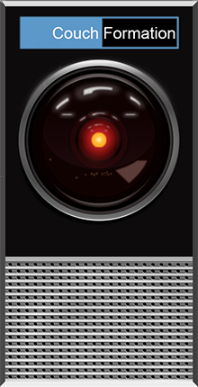

# Couch Formation 3.0.1 RC3



Toolset for running and managing Couchbase clusters. Supports AWS, GCP, Azure, VMware, and Couchbase Capella.

Runs on any POSIX style client such as macOS and Linux.

## Version 2.0
> If you need to use the prior version, [access it here](https://github.com/couchbaselabs/couch-formation/tree/Version_2.0).<br>
> ```git clone -b Version_2.0 https://github.com/couchbaselabs/couch-formation```

## Disclaimer

> This package is **NOT SUPPORTED BY COUCHBASE**. The toolset is under active development, therefore features and functionality can change.

## Prerequisites
- Python 3.9
- Cloud CLI/SDKs
  - [AWS CLI](https://aws.amazon.com/cli/)
  - [Google Cloud CLI](https://cloud.google.com/sdk/docs/quickstart)
  - [Azure CLI](https://docs.microsoft.com/en-us/cli/azure/install-azure-cli)
- Homebrew (for macOS)
- vCenter managed cluster with Distributed Virtual Switches for VMware

## Quick Start
Setup Python environment:
````
$ cd couch-formation
$ ./setup.sh
````
Create an image in the target cloud:
````
$ bin/cloudmgr image build --cloud aws
$ bin/cloudmgr image build --cloud gcp
$ bin/cloudmgr image build --cloud azure
````
Create the environment
````
$ bin/cloudmgr create cluster --name dev01 --cloud gcp
````
List node information:
````
$ bin/cloudmgr list nodes
````
Uninstall nodes:
````
$ bin/cloudmgr destroy cluster --name dev03 --cloud capella
````
Entirely remove an environment, and all its components:
````
bin/cloudmgr remove --name test01
````
To build a blank node without any additional configuration from a public image, use generic mode:
````
bin/cloudmgr create generic --name test01 --cloud aws
````

## Cloudmgr Utility
The cloudmgr utility orchestrates environment builds. It accelerates environment build time by attempting to autoconfigure as much as possible, and using multiple choice prompts when possible for any answers it requires.

General syntax:
````
bin/cloudmgr command sub_command [ parameters ]
````

| Parameters | Description                                                                       |
|------------|-----------------------------------------------------------------------------------|
| -h, --help | Show help message and exit                                                        |
| --name     | Environment name (if not provided one will be generated, must conform to RFC1035) |
| --cloud    | Cloud type (aws,gcp,azure,vmware)                                                 |
| --zone     | Use One Availability Zone                                                         |                                                     |

| Version Command | Description           |
|-----------------|-----------------------|
| version         | Show version and exit |

| Image Command | Description                                               |
|---------------|-----------------------------------------------------------|
| image list    | List images                                               |
| image build   | Build an image                                            |
| image delete  | Delete an image                                           |

| Create Command | Description               |
|----------------|---------------------------|
| create cluster | Create cluster            |
| create app     | Create app nodes          |
| create sgw     | Create Sync Gateway nodes |

| Create Command | Description                         |
|----------------|-------------------------------------|
| deploy cluster | Deploy a previously created cluster |
| deploy app     | Deploy previously created app nodes |
| deploy sgw     | Deploy previously created sgw nodes |

| Create Command  | Description      |
|-----------------|------------------|
| destroy cluster | Remove a cluster |
| destroy app     | Remove app nodes |
| destroy sgw     | Remove sgw nodes |

| Version Command | Description                   |
|-----------------|-------------------------------|
| remove          | Remove an entire environment  |

| Version Command | Description |
|-----------------|-------------|
| list images     | List images |
| list nodes      | List nodes  |
